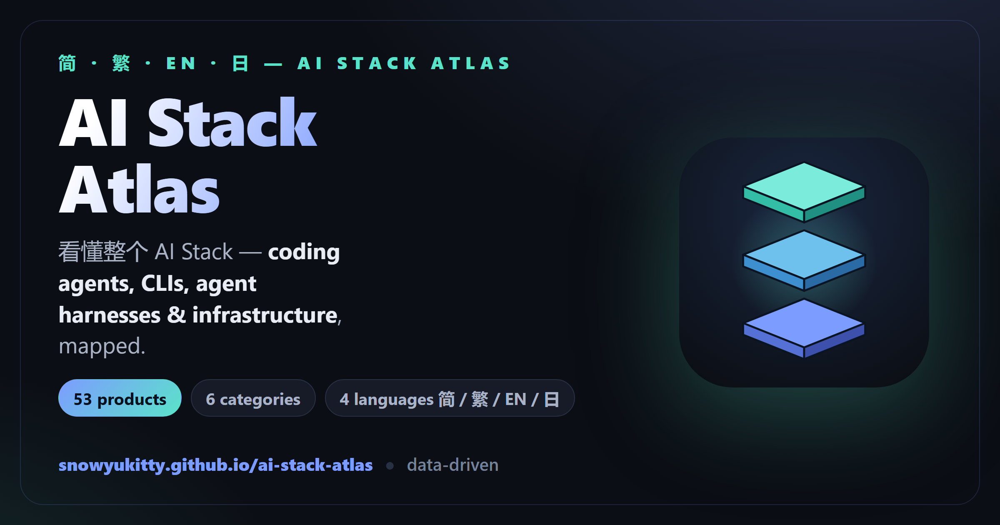

<div align="center">



# AI Stack Atlas · AI Stack 图鉴

### **[🔗 Live site → snowyukitty.github.io/ai-stack-atlas](https://snowyukitty.github.io/ai-stack-atlas/)**

A **four-language (简体 · 繁體 · English · 日本語)**, data-driven field guide & comparison hub
for the modern AI stack — **coding agents · CLIs · agent harnesses · infrastructure**.

`53 products` · `6 categories` · `4 languages` · `side-by-side compare` · `benchmarks & charts` · `one self-contained file`

</div>

---

Built with [Astro](https://astro.build) and bundled into **one self-contained
`dist/index.html`** — all CSS and JS inlined, the favicon embedded as a data URI,
and the six "pages" turned into in-page views. **Double-click it and it just works**:
no server, no Node, fully offline, copy it to a USB stick or send it to anyone.
Astro is only the authoring/build tool — content stays **data-driven** so it's easy
to **keep up to date**.

> Data last reconciled against public sources: **2026-06-30**
> (Terminal-Bench 2.1, SWE-bench Pro, Artificial Analysis Index, vendor announcements).

---

## Daily use (no terminal needed)

- **Just view it:** double-click **`Open-Site.cmd`** (or `dist/index.html` directly).
- **After editing content:** double-click **`Rebuild-and-Open.cmd`** — it rebuilds the
  single file and opens it.

That's it. No `npm run dev` every time.

## Quick start (for editing / building)

```bash
npm install
npm run open     # build the single file AND open it in your browser
npm run build    # build only → dist/index.html (the whole site, one file)
npm run dev      # optional: live-reload dev server at http://localhost:4321 while editing
npm run verify   # validate data + type-check + build (run before committing)
npm run smoke    # browser smoke-test the built dist/index.html (needs a build first)
```

`npm run smoke` drives the built single file in headless Chromium (desktop +
mobile) and asserts the things that have actually regressed before — no duplicate
ids, no horizontal overflow, deep links not occluded by the sticky header, search
grammar, a11y affordances, theme handling, and the JS-on / JS-off view behavior.
It needs Playwright's Chromium once: `npx playwright install chromium`. CI runs it
on every push after the build.

`npm run verify` chains `validate:data` (data-integrity checks: unique ids, valid
references, even locale keys, sane `LAST_UPDATED`), `check` (`astro check`), and
`build`. CI runs the same steps on every push.

Requires Node 22.12+ (Astro 7's minimum; developed on Node 22). `npm install` is only needed once.

---

## How it works

The site renders **all four languages into the HTML**, and CSS shows only the active
one based on `<html data-lang="…">`. Switching language (or light/dark theme) is instant,
client-side, and persisted to `localStorage` — no rebuild, no page reload.

The data is authored in **three locales** (`zh` 简体 / `en` / `ja`); **Traditional Chinese
(繁體) is derived from `zh` at build time** via OpenCC (`src/lib/hant.ts`, Taiwan `twp`
preset), so the 4th language needs no duplicated strings.

```
src/
  data/                ← EDIT THESE TO UPDATE CONTENT
    products.ts        · every product (the catalog)
    categories.ts      · the six categories
    concepts.ts        · the concept / glossary explainers
    rankings.ts        · personal rankings + public benchmarks
    ui.ts              · UI strings + LAST_UPDATED lives in products.ts
  lib/types.ts         · the data model (Product, Concept, …)
  components/
    L.astro            · i18n text helper ({zh,en,ja}; 繁 derived from zh via lib/hant.ts)
    Header / Footer / ProductCard
    views/             · Home, Catalog, Compare (matrices), Concepts, Rankings (bar charts), Stack
  layouts/Base.astro   · <head>, inlined favicon, lang/theme + single-page router scripts
  pages/index.astro    · the ONLY page — composes all five views into one file
  styles/global.css    · theming (--vars), i18n toggle, all styling
brand/
  icon.svg             · icon master (isometric stack of three diamond layers)
  icon.ico             · multi-size icon for the Windows desktop shortcut
scripts/
  validate-data.mjs    · data-integrity checks (npm run validate:data)
pw/
  smoke.mjs            · browser smoke test of the built file (npm run smoke)
```

All six views render into the one page; a tiny inline router (`Base.astro`) shows one
at a time via `#hash`, with working back/forward and deep links
(`#catalog/cat=framework`, `#catalog/p-claude-code`, `#concepts/c-harness`, `#compare`).
Charts (the benchmark bars in Rankings, the category-distribution and layered-stack
diagrams on Home) and the **Compare** comparison matrices are pure CSS/HTML built from
the same data — no chart library, so the single file stays self-contained.

### Adding / updating a product

Open `src/data/products.ts` and add an entry to the `products` array. Every
human-readable field is a `Loc` (`{ zh, en, ja }`) so it stays trilingual:

```ts
{
  id: 'my-tool',
  name: 'My Tool',
  vendor: 'Acme',
  category: 'coding-cli',           // coding-cli | coding-ide | app-builder | framework | infra | model
  command: 'mytool',                // optional CLI command
  subtype: { zh: '…', en: '…', ja: '…' },
  tagline: { zh: '…', en: '…', ja: '…' },
  description: { zh: '…', en: '…', ja: '…' },
  models: ['Claude Opus 4.8'],
  pricing: { zh: '…', en: '…', ja: '…' },
  license: 'open',                  // open | partial | closed
  status: 'active',                 // active | beta | sunset
  rating: 4,                        // optional personal 0–5
  benchmarks: [{ label: '…', value: '…' }],
  pros: [{ zh: '…', en: '…', ja: '…' }],
  cons: [{ zh: '…', en: '…', ja: '…' }],
  bestFor: { zh: '…', en: '…', ja: '…' },
  links: [{ label: 'Docs', url: 'https://…' }],
  tags: ['cli', 'open-source'],
  featured: true,                   // optional: show on the homepage
  mine: true,                       // optional: your own project
}
```

Then bump `LAST_UPDATED` at the top of `products.ts` and run `npm run build`.
Search, category filters, the catalog, homepage counts and rankings all update
automatically from the data.

### Adding a concept or ranking

- Concepts: append to `concepts` in `src/data/concepts.ts` (`see: [...]` cross-links).
- Rankings: append to `rankings` in `src/data/rankings.ts` (`kind: 'personal' | 'benchmark'`;
  set `productId` to link a row back to its catalog card).

---

## Deploying

It's static — `dist/` works on any static host.

- **GitHub Pages (project site):** set `site` and `base` in `astro.config.mjs`
  (e.g. `base: '/agentic-ai-stack'`), then publish `dist/`.
- **Vercel / Netlify / Cloudflare Pages:** framework preset "Astro",
  build `npm run build`, output `dist`.
- **Anywhere:** copy `dist/` to any web root.

---

## Brand / icon

The favicon is an **isometric stack of three diamond layers** (model → harness →
infrastructure) in the brand teal→blue gradient. The master lives at
`brand/icon.svg` and is inlined into `<head>` as a data URI (so the single file
stays self-contained). It was authored with the **ai-iconflow** toolkit
(`python -m iconflow` — SVG master → render-and-review loop → packed icon sets).

To regenerate after editing `brand/icon.svg`:

```bash
python -m iconflow review brand/icon.svg                 # eyeball it at 16–256px
python -m iconflow build  brand/icon.svg --out brand/out --targets web      # favicon set
python -m iconflow build  brand/icon.svg --out brand/out-app --targets electron  # multi-size icon.ico
```

then re-encode `brand/out/favicon.svg` as the data URI in `src/layouts/Base.astro`.
`brand/icon.ico` (used by the Windows desktop shortcut) comes from the electron build.

**Social-share card.** The Open Graph / Twitter card (the 1200×630 image that shows
when the link is pasted into Slack / X / WeChat / LINE) is `public/og.png`, served at
`<site>/og.png` and referenced by the `og:image` / `twitter:image` meta in `Base.astro`.
It's a committed, deployed asset — not inlined — so it only affects the hosted URL, not
the offline single file. Regenerate after a brand change with:

```bash
node brand/make-og.mjs    # renders public/og.png from brand/icon.svg (needs playwright)
```

---

## Notes on the data

- **Ratings** are a personal 0–5 take, not a benchmark.
- **Benchmark figures** cite public sources and shift with each model/agent release —
  treat them as a snapshot, not gospel.
- Two entries (**OpenClaw**, **Hermes Agent**) are the owner's own projects, marked `mine`
  and categorized as **infrastructure**, not "coding agents".
